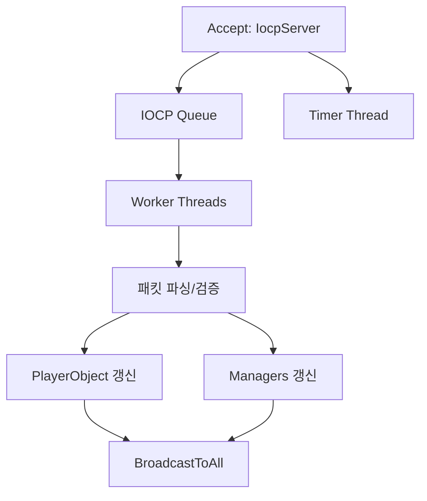
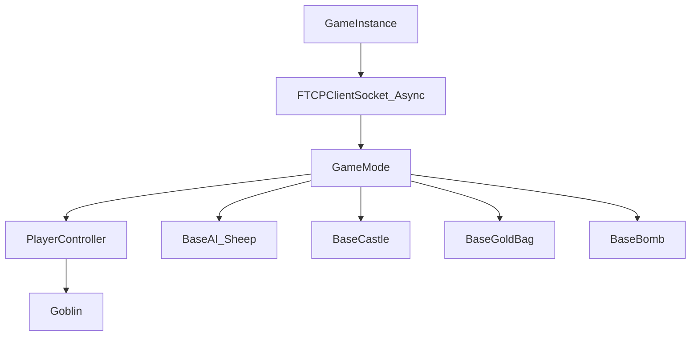
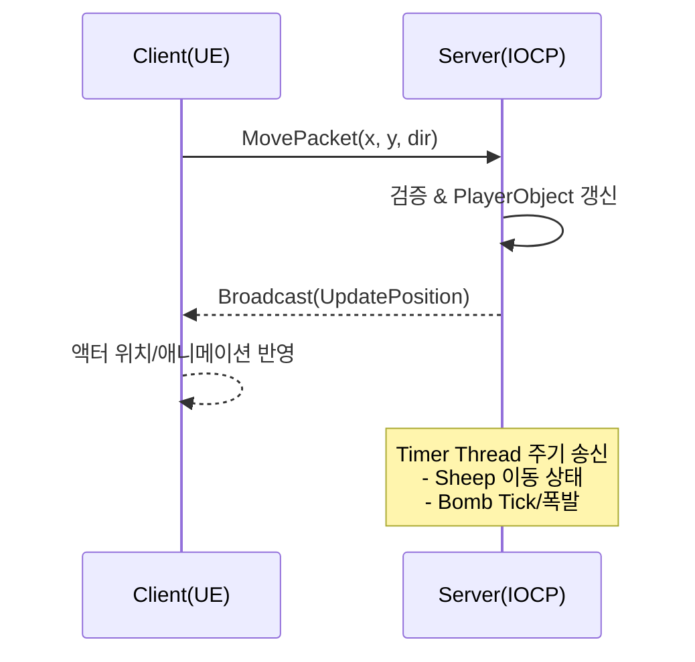

## Tiny Sword 
### 적군의 성을 파괴하고 마지막 1인이 되어라!

# 🧩 Tiny Sword — 2D 멀티플레이 전략 전투 게임

> 언리얼 엔진(2D) 클라이언트와 C++ IOCP 서버가 **TCP**로 실시간 통신하여  
> **이동/공격/NPC/아이템** 상태를 동기화하는 멀티플레이 게임입니다.  
> 본 문서는 **서버 구조**, **클라이언트 구조**, **양방향 통신 흐름**을 한눈에 파악할 수 있도록 정리했습니다.

---

## 🎮 프로젝트 개요

- 플레이어는 각자 성(Castle)을 보유하고, 자원(양·골드)을 관리하며 전투를 통해 승리합니다.  
- **Server-Authoritative**: 모든 게임 판단(검증/동기화/브로드캐스트)은 서버가 수행하고,  
  클라이언트는 입력 처리와 시각화를 담당합니다.

---

## ⚙️ 기술 스택

| 구분 | 사용 기술 |
|---|---|
| **클라이언트** | Unreal Engine 5 (Paper2D / PaperZD), C++ |
| **서버** | C++ (Win32 IOCP, Multi-thread, Timer Thread, Critical Section) |
| **통신** | TCP 기반 커스텀 바이너리 프로토콜 |
| **도구** | Visual Studio, Wireshark, Git, PlantUML / Mermaid |

---

## 서버 구조 (C++ IOCP)

IOCP 기반 멀티스레드 서버가 모든 소켓 I/O를 비동기로 처리합니다.  
주요 책임은 **연결 관리 → 패킷 파싱/검증 → 게임 상태 갱신 → 브로드캐스트** 입니다.

### 서버 핵심 컴포넌트

- **IocpServer**
  - TCP Accept 및 클라이언트 세션 관리
  - IOCP 완료 포트를 통한 비동기 I/O 처리
  - Worker Thread Pool 및 Timer Thread 생성/관리
  - 클라이언트 연결/해제 이벤트 처리

- **Worker Threads**
  - IOCP Queue에서 완료된 I/O 작업 수신
  - 수신 패킷 파싱 및 프로토콜 검증
  - 게임 로직 처리 (이동, 공격, 상태 변경 등)
  - PlayerObject 및 Manager 상태 갱신
  - BroadcastToAll을 통한 클라이언트 동기화 패킷 전송
  
- **Timer Thread**
  - 고정 틱(Tick) 간격으로 게임 상태 업데이트 (Sheep, Bomb 
  - 주기적인 동기화 패킷 전송
  

#### 서버 흐름(요약)

## 🎨 클라이언트 구조 (Unreal Engine 2D)

Unreal Engine 기반 클라이언트는 **GameInstance**가 TCP 소켓을 소유하여  
**레벨 전환 시에도 서버와 연결을 유지**합니다.  
서버로부터 수신된 패킷은 **GameMode** 및 각 액터에 반영되어  
**실시간으로 화면 상태를 갱신**합니다.

---

### 핵심 컴포넌트

- **FTCPClientSocket_Async**
  - TCP 연결(`Connect/Disconnect`)
  - 비동기 수신(`OnRecvCompleted`)
  - 수신 버퍼를 패킷 단위로 파싱(`CreatePacket`)

- **GameInstance / GameMode**
  - 연결 초기화 및 세션 유지
  - 액터 스폰 및 월드 상태 동기화 관리
  - 서버로부터 수신한 상태 갱신을 각 오브젝트에 전달

- **PlayerController / Goblin**
  - 입력 처리 (이동, 공격 등)
  - 이동 및 공격 명령을 패킷으로 서버에 전송
  - Goblin 캐릭터 상태 및 애니메이션 제어

- **BaseAI_Sheep / BaseBomb / BaseCastle / BaseGoldBag / BaseMeat**
  - Tick 기반의 상태 업데이트
  - 충돌, 사망, 아이템 획득 등 상호작용 처리

---

#### 클라이언트 흐름(요약)

## 🔗 서버 ↔ 클라이언트 통신 흐름

클라이언트의 입력은 **서버에서 검증 및 적용**된 후,  모든 클라이언트에 **브로드캐스트되어 동기화**됩니다.  
또한 **Timer Thread**가 주기적으로 NPC 이동 및 폭발 정보를 송신합니다.

---

## 패킷 처리 파이프라인
1. 클라이언트 → 서버: TCP 소켓으로 패킷 전송
2. IOCP Queue: 비동기 수신 완료 이벤트 대기
3. Worker Thread: 패킷 파싱 → 검증 → 게임 로직 실행 → 상태 갱신
4. BroadcastToAll: 변경된 상태를 모든 클라이언트에 전송

### 주요 패킷

| 이름                | 송신              | 목적       | 주요 필드                 |
| ----------------- | --------------- | -------- | --------------------- |
| **MovePacket**    | Client → Server | 이동 요청    | posX, posY, dir       |
| **AttackPacket**  | Client → Server | 공격 요청    | type, targetPos       |
| **SpawnPacket**   | Server → All    | 액터 생성    | type, spawnPos, tagId |
| **DestroyPacket** | Server → All    | 액터 제거    | actorId, reason       |

### 주요 특징

- **실시간 동기화**: 이동, 공격, NPC, 아이템 상태가 모든 클라이언트에 즉시 반영됩니다.

- **서버 권한 모델(Server-Authoritative)**: 서버 검증 후 반영되어 클라이언트 간 불일치 및 치트를 방지합니다.

- **주기 송신 최적화**: Timer Thread를 활용해 워커 스레드의 부하를 분리합니다.

- **2D 애니메이션 시스템**: PaperZD 기반 상태 전환 (idle / walk / attack / dead)

- **연결 안정성**: GameInstance 단위 소켓 유지로, 레벨 전환 시에도 연결이 유지됩니다.
